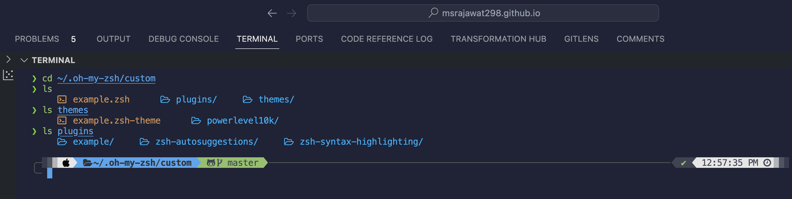

How to setup your Mac Terminal to be beautiful

## Packages Name:
- [oh-my-zsh](https://ohmyz.sh/#install)]

## Theme name:
- [powerlevel10k](https://github.com/romkatv/powerlevel10k/blob/master/README.md#instant-prompt)

## Plugin Name:
- [zsh-autosuggestions](https://github.com/zsh-users/zsh-autosuggestions/blob/master/INSTALL.md)
- [zsh-syntax-highlighting](https://github.com/zsh-users/zsh-syntax-highlighting/blob/master/INSTALL.md)
- [colorls](https://github.com/athityakumar/colorls)
    - if you using mac terminal, in mac ruby already installed just run ```gem install colorls```
    - if you using other OS you have to install first ruby and run ```gem install colorls```

## Nerd Fonts
- [nerd-fonts](https://github.com/ryanoasis/nerd-fonts/releases)
    -[In my case I have used Hack as font style](https://github.com/ryanoasis/nerd-fonts/releases/download/v3.1.1/Hack.zip)


## JFYI :

- This is the default path .zshrc : ```/Users/your system user name/.zshrc```
- This is the default path .oh-my-zsh : ```/Users/your system user name/.oh-my-zsh```
- ```cd .oh-my-zsh/custom```
- Inside this there will be two folder plugin and theme you can put you plugin and theme here.
- using this cmd you can change your default terminal in mac ```sudo chsh -s /bin/zsh ```
    - For checking you can use ```echo $0```
### Screenshots
<p align="center">  </p>


## Reference:

- [dotfiles](https://github.com/ChristianLempa/dotfiles/blob/main/.zshrc)